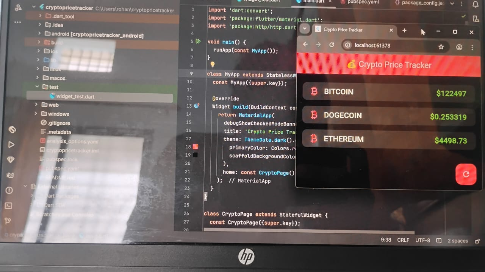

# cryptopricetracker

A new Flutter project.

## Getting Started

This project is a starting point for a Flutter application.

A few resources to get you started if this is your first Flutter project:

- [Lab: Write your first Flutter app](https://docs.flutter.dev/get-started/codelab)
- [Cookbook: Useful Flutter samples](https://docs.flutter.dev/cookbook)

For help getting started with Flutter development, view the
[online documentation](https://docs.flutter.dev/), which offers tutorials,
samples, guidance on mobile development, and a full API reference.

# 💰 Crypto Price Tracker (Flutter + REST API)

## 📌 Objective
Learn to integrate REST APIs in Flutter by fetching and displaying live cryptocurrency prices.

## 🚀 API Used
[CoinGecko API](https://www.coingecko.com/en/api)  
Endpoint used:

## ⚙️ Features
- Fetch live Bitcoin, Ethereum, and Dogecoin prices
- JSON parsing with `http` package
- Error handling (no internet, bad response)
- Loading indicator
- Refresh button

## 📸 Screenshot

## 🔗 How to Run
1. Clone repo
2. Run `flutter pub get`
3. Run `flutter run`  
